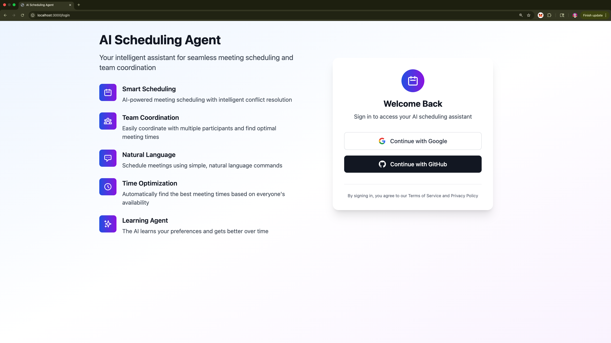
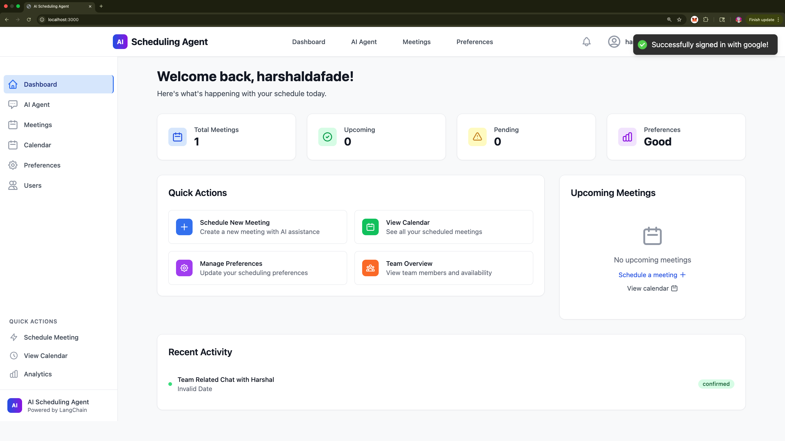
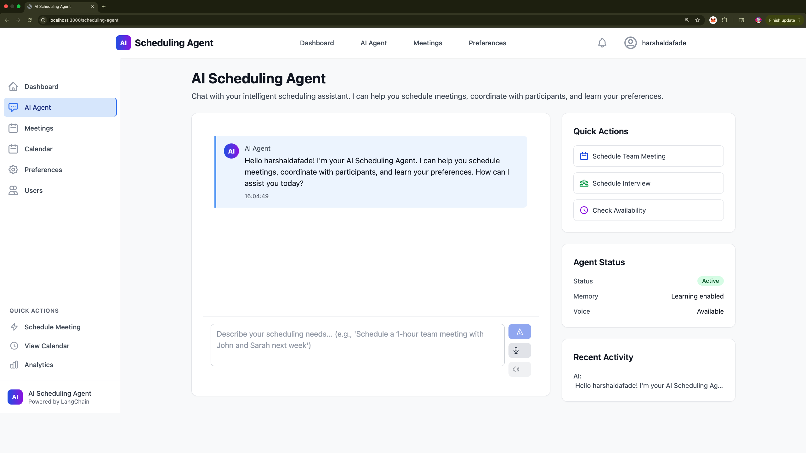
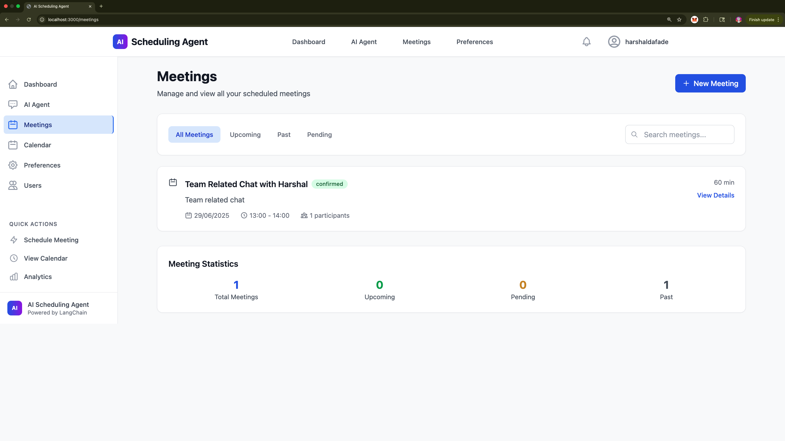
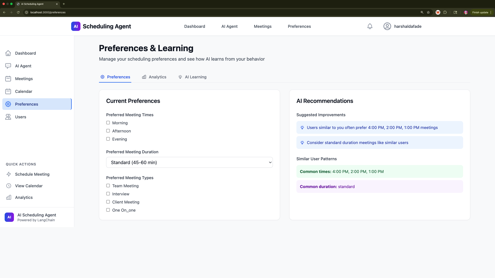
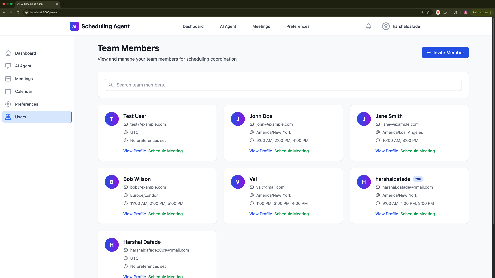

# Scheduling Agent

A full-stack, AI-powered scheduling assistant that helps you manage meetings, resolve conflicts, and coordinate with participants using natural language. Built for personal productivity, extensibility, and robust security.

---

## 🚀 Features
- Natural language scheduling (create, update, delete meetings)
- AI-powered conflict detection and resolution
- Multi-user support with OAuth (Google, GitHub)
- JWT authentication with refresh tokens
- Secure, robust backend (FastAPI, LangChain, SQLite/Postgres)
- Modern React frontend (TypeScript, Tailwind CSS)
- Voice/text interface (optional)
- Rate limiting, CSRF protection, and token blacklisting
- Extensible for new LLMs (OpenAI, Gemini, Claude, local, etc.)
- CI/CD with GitHub Actions

---

## 🛠️ Tech Stack
- **Backend:** Python 3.9+, FastAPI, LangChain, SQLite (dev) / PostgreSQL (prod)
- **Frontend:** React 18, TypeScript, Tailwind CSS, React Query
- **AI/LLM:** Gemini, OpenAI, or any LangChain-compatible LLM
- **Auth:** OAuth (Google, GitHub), JWT, refresh tokens
- **Other:** Redis (optional), Docker-ready, GitHub Actions for CI

---

## 📁 Project Structure
```
Scheduling-Agent/
├── backend/                 # FastAPI backend
│   ├── app/                 # Core backend code
│   ├── requirements.txt
│   ├── main.py
│   └── ...
├── frontend/                # React frontend
│   ├── src/
│   ├── package.json
│   └── ...
├── docs/                    # Documentation
├── .github/                 # GitHub Actions, issue templates
├── .env.example             # Backend env template
├── README.md
└── LICENSE
```

---

## 🖼️ Screenshots

| Login & OAuth | Google Sign-In | Dashboard |
|:---:|:---:|:---:|
|  <br> _Login page with Google/GitHub OAuth_ |  <br> _Google account selection for OAuth_ |  <br> _Main dashboard with meeting stats and quick actions_ |

| AI Agent Chat | Meetings | Calendar |
|:---:|:---:|:---:|
|  <br> _Conversational AI scheduling assistant_ |  <br> _List and manage all meetings_ |  <br> _Calendar view of scheduled meetings_ |

| Preferences & Learning | Team Members |
|:---:|:---:|
|  <br> _Set preferences and view AI recommendations_ |  <br> _View and manage team members_ |

**Descriptions:**
- **Login & OAuth:** Secure sign-in with Google or GitHub.
- **Google Sign-In:** OAuth flow for Google authentication.
- **Dashboard:** Overview of meetings, quick actions, and recent activity.
- **AI Agent Chat:** Conversational scheduling with the AI agent.
- **Meetings:** View, search, and manage all meetings.
- **Calendar:** Visual calendar of all scheduled meetings.
- **Preferences & Learning:** Manage your preferences and see AI recommendations.
- **Team Members:** View and coordinate with your team.

---

## ⚡ Quickstart

### 1. Clone the repo
```bash
git clone git@github.com:harshaldafade/Scheduling-Agent.git
cd Scheduling-Agent
```

### 2. Setup Environment Variables
- Copy `backend/env.example` to `backend/.env` and fill in your secrets.
- Copy `frontend/env.example` to `frontend/.env` and set your API URL.

### 3. Backend Setup
```bash
cd backend
python -m venv venv
source venv/bin/activate  # On Windows: venv\Scripts\activate
pip install -r requirements.txt
```

### 4. Frontend Setup
```bash
cd frontend
npm install
```

### 5. Run the App (Development)
- **Backend:**
  ```bash
  cd backend
  uvicorn main:app --reload
  ```
- **Frontend:**
  ```bash
  cd frontend
  npm start
  ```

---

## 🔑 Environment Variables

### Backend (`backend/.env`)
See `backend/env.example` for all options. Key variables:
- `OPENAI_API_KEY`, `GEMINI_API_KEY`, etc.
- `SECRET_KEY` (generate securely!)
- `DATABASE_URL` (SQLite for dev, Postgres for prod)
- `GOOGLE_CLIENT_ID`, `GOOGLE_CLIENT_SECRET`, etc.
- `FRONTEND_URL`, `ALLOWED_ORIGINS`

### Frontend (`frontend/.env`)
See `frontend/env.example` for all options. Key variables:
- `REACT_APP_API_URL`
- `REACT_APP_FRONTEND_URL`

---

## 🧪 Testing
- **Backend:**
  ```bash
  cd backend
  pytest
  ```
- **Frontend:**
  ```bash
  cd frontend
  npm test
  ```

---

## 🔒 Security Notes
- Never commit your real `.env` files or secrets.
- Change `SECRET_KEY` in production.
- Use HTTPS and secure cookies in production.
- Set proper CORS and OAuth redirect URIs for your deployment.
- See the README and `env.example` for more security tips.

---

## 🤝 Contributing
- Open issues for bugs, features, or questions
- Fork and submit pull requests
- See [CONTRIBUTING.md](CONTRIBUTING.md) for code style and test instructions

---

## ⚙️ CI/CD
- GitHub Actions for backend/frontend linting and tests
- See `.github/workflows/ci.yml` for details

---

## 📄 License
MIT License — see [LICENSE](LICENSE)

---

## 📬 Contact
**Harshal Dafade**  
[GitHub](https://github.com/harshaldafade)

---

*Built with ❤️ for productivity and learning.* 